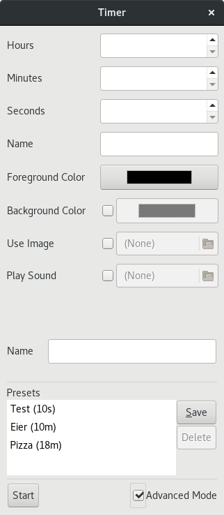
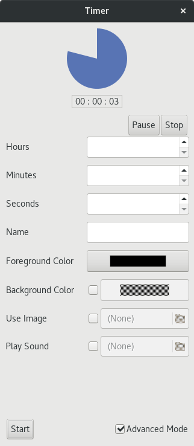

Timer
=====

Proof-of-concept egg timer written in PyGTK

Please note that the purpose of this project at the time was to get familiar with PyGTK.
As a result the code is neither fully functional nor very polished.

### Usage

Simply execute `src/timer.py`. The UI (shown in the screenshots below) should be mostly self explanatory. Basic configuration options are persisted in `src/timer.conf`.

### Screenshots

